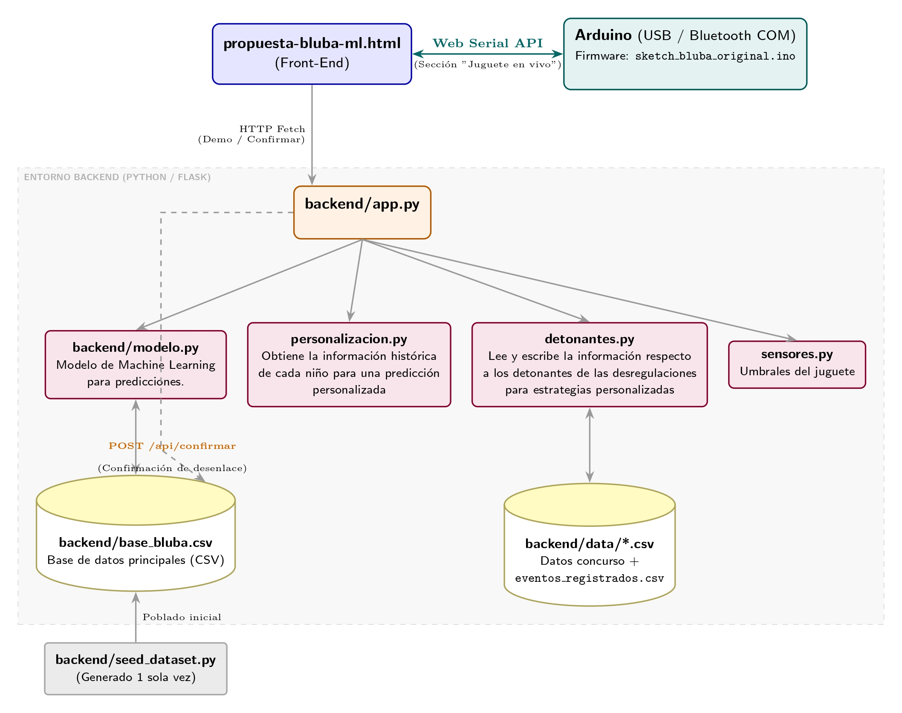

# Propuesta Bluba — Anticipación de crisis conductual con ML

Hackatón FICA UFRO × Bluba SpA. Este documento explica cada archivo
presente en este repositorio y cómo encaja en el esquema general del
proyecto. 

## 1. La idea en una imagen



## 2. Archivos en la raíz

| Archivo | Qué es |
|---|---|
| `propuesta-bluba-ml.html` | El front-end completo: la propuesta navegable más tres piezas interactivas (demo de predicción, confirmación de resultado real, y alertas en vivo del juguete).
| `backend` | El back-end completo, posee los archivos de Machine Learning y la conección con el dispositivo bluetooth.
## 3. `propuesta-bluba-ml.html` — secciones

### 3.1 predicción + conocimiento del niño/a

- **Formulario de registro** Seleccionar un usuario y agregar su
  registro diario con las opciones: sueño, ánimo, apoyo, GI, rutina, desregulaciones
  en los últimos 3 días, alimentación e interacción
  social, notas libres. Devuelve riesgo, probabilidad, confianza, factores y
  acciones; si el usuario tiene historial documentado, también lo que ya sabemos de este niño/a.
  
- **Formulario "Agregar un detonante conocido"**:
  siempre visible, independiente de si ya se predijo. Envía con tipo de evento, intensidad,
  detonante, estrategia usada y resultado.

### 3.2 `#confirmar` — cierra el ciclo sintético → real (nueva)

Formulario elige un usuario y la fecha de un día que
ya se registró, y confirma si hubo o no
una crisis real ese día. 

## 4. Carpeta `backend/`

### 4.1 Cómo correrlo

```bash
cd backend
pip install -r requirements.txt
python seed_dataset.py     # ya viene un CSV de ejemplo, pero puedes regenerarlo
python app.py              # API en http://localhost:5000
```

### 4.2 Archivo por archivo

| Archivo | Rol en el esquema general |
|---|---|
| `requirements.txt` | Dependencias de los scripts
| `requirements-bridge.txt` | Dependencias para un script puente Bluetooth 
| `seed_dataset.py` | Genera `base_bluba.csv`: 50 usuarios sintéticos × 30 días, con una fórmula de riesgo que produce la etiqueta sintética `crisis_24h`.
| `base_bluba.csv` | La "base de datos": `usuario_id, fecha, horas_sueno, calidad_sueno, estado_basal, nivel_apoyo, salud_gi, cambio_rutina, desregulaciones_previas, alimentacion, interaccion_social, notas, crisis_24h`. Los registros nuevos guardan `crisis_24h` vacío hasta que se confirma. |
| `personalizacion.py` | Módulo compartido, estadisticos básicos de la población (media/std) por id. Lo reutilizan `modelo.py` y `sensores.py`. |
| `modelo.py` | Imputación MICE + un `RandomForestClassifier` sobre valores crudos + z-scores personalizados. `VENTANA_DESREGULACIONES_DIAS = 3` deja explícito que `desregulaciones_previas` es un conteo de 3 días. Entrena con cualquier fila que tenga `crisis_24h`.|
| `detonantes.py` | Detonantes por niño combina `data/1_casos_anonimizados.csv` + `data/5_eventos_desregulacion_tutor.csv` con `data/eventos_registrados.csv`. `perfil_conocido(usuario_id)`.|
| `sensores.py` | Procesamiento de las señales del juguete sensorial. |
| `app.py` | La API Flask. |
| `arduino/sketch_bluba_original.ino` | Firmware del juguete para enviar información a la página|
| `data/1_casos_anonimizados.csv` | Dato real del concurso: ficha de los 4 casos. Solo lectura. |
| `data/5_eventos_desregulacion_tutor.csv` | Dato real del concurso: 7 eventos de crisis documentados. Solo lectura. |
| `data/eventos_registrados.csv` | Se crea automáticamente la primera vez que alguien agrega un detonante desde el HTML. Aquí viven los eventos nuevos, separados del CSV original del concurso. |
| `sensores_bluba.csv` | Log crudo de eventos del juguete (`sensores.py`); vacío hasta que algo llame a `registrar_evento`. |


### 4.3 Personalización por niño/a

En vez de un modelo (o firmware) distinto por niño/a, se personaliza el
input: cada valor se compara contra el propio historial del niño/a.

### 4.4 Detonantes y estrategias — reales + los que agregue la familia

`detonantes.py` combina dos fuentes: los 7 eventos reales del concurso
(4 niños) y cualquier evento nuevo agregado desde `#demo`, para cualquier
`usuario_id`. El CSV original del concurso nunca se sobrescribe — los
eventos nuevos quedan en un archivo aparte (`eventos_registrados.csv`).
